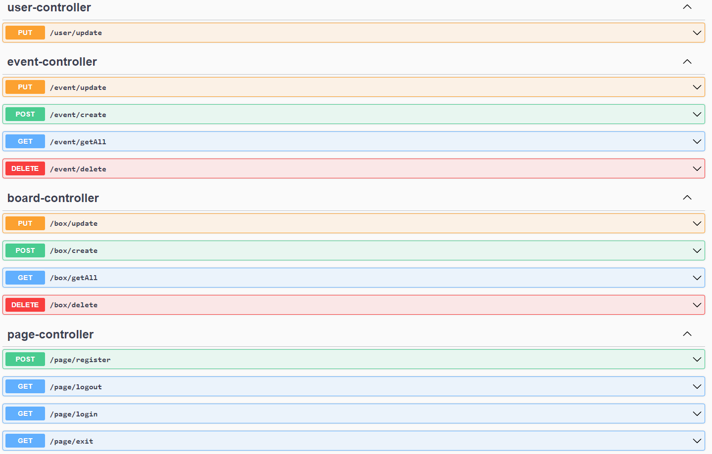

# A simple API for Todolist

This program is written in Java 11 with Spring boot v2.7.5. You also need to connect to the Postgres database to use it.

To test the inputs, you can use Swagger; After running the code in IDE, the program will run on port 8085. You can configure the database and application connection specifications in the `application.properties` file in the resources folder.

## The code

In the `controller` package, there are 4 REST classes. You can see the type of operation and how to implement it.
